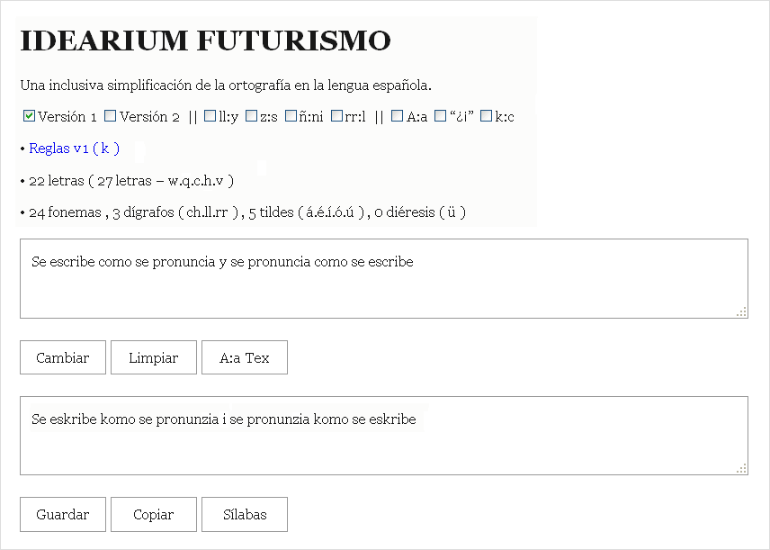
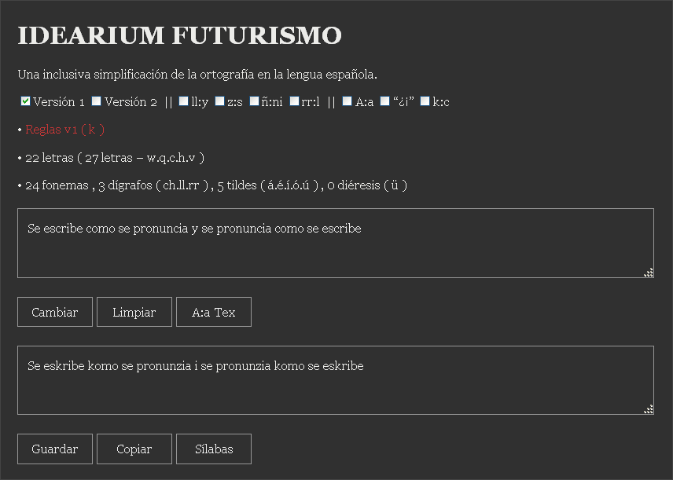

# ORTOGRAFÍA SIMPLIFICADA ( MODO K )

Una inclusiva simplificación de la ortografía en la lengua española.

## IMAGENES





## REGLAS

### Reglas : Versión 1 (&nbsp;Base : Bibliografía&nbsp;)

&#8226; 1.&nbsp; La letra 'v' se reemplaza por la letra 'b'.

&#8226; 2.&nbsp; La letra 'c' se reemplaza por la letra 'z' en las combinaciones 'ce' y 'ci'.

&#8226; 3.&nbsp; La letra fuerte 'g' se reemplaza por la letra 'j' en las combinaciones 'ge' y 'gi'.

&#8226; 4.&nbsp; El dígrafo 'gu' se reemplaza por la letra suave 'g' en las combinaciones 'gue' y 'gui'.

&#8226; 5.&nbsp; El dígrafo 'qu' se reemplaza por la letra 'k' en las combinaciones 'que' y 'qui'.

&#8226; 6.&nbsp; La letra 'q' y la letra 'c' se reemplazan por la letra 'k'.

&#8226; 7.&nbsp; La letra vocal 'y' se reemplaza por la letra vocal 'i'.

&#8226; 8.&nbsp; La letra muda 'h' y la diéresis 'ü' desaparecen.

&#8226; 9.&nbsp; La letra 'r' conserva sus reglas tradicionales.

### Reglas : Versión 2 (&nbsp;Base : Versión 1&nbsp;)

&#8226; 1.&nbsp; El dígrafo 'ch' se reemplaza por la letra 'c'.

&#8226; 2.&nbsp; El dígrafo 'll' se reemplaza por la letra 'h'.

&#8226; 3.&nbsp; El dígrafo 'rr' se reemplaza por la letra 'v'.

&#8226; 4.&nbsp; La letra fuerte 'r' se reemplaza por la letra 'v'.

&#8226; 5.&nbsp; La letra 'm' se reemplaza por la letra 'n' en las combinaciones 'mb', 'mp' y 'mn'.

&#8226; 6.&nbsp; La letra 'x' se reemplaza por las letras 'k','s','j' o la combinación 'ks' según el contexto.

## RESUMEN

&#8226; 1.&nbsp; La letra 'k' siempre se pronuncia como la letra común 'k'. (&nbsp;v1&nbsp;) {&nbsp;letra 'k' = fonema /k/&nbsp;}

&#8226; 2.&nbsp; La letra 'g' siempre se pronuncia como la letra suave 'g'. (&nbsp;v1&nbsp;) {&nbsp;letra 'g' = fonema /g/&nbsp;}

&#8226; 3.&nbsp; La letra 'r' siempre se pronuncia como la letra suave 'r'. (&nbsp;v2&nbsp;) {&nbsp;letra 'r' = fonema /&#638;/&nbsp;}

&#8226; 4.&nbsp; La letra 'v' siempre se pronuncia como el dígrafo 'rr'. (&nbsp;v2&nbsp;) {&nbsp;letra 'v' = fonema /r/&nbsp;}

&#8226; 5.&nbsp; La letra 'h' siempre se pronuncia como el dígrafo 'll'. (&nbsp;v2&nbsp;) {&nbsp;letra 'h' = fonema /&#654;/&nbsp;}

&#8226; 6.&nbsp; La letra 'c' siempre se pronuncia como el dígrafo 'ch'. (&nbsp;v2&nbsp;) {&nbsp;letra 'c' = fonema /&#116;&#865;&#643;/&nbsp;}

## FONEMAS

&#8226; 1.&nbsp; Real Academia Española (&nbsp;RAE&nbsp;)

&#8226; 1.&nbsp; / a , e , i , o , u , b , ch , d , f , g , j , k , l , ll , m , n , ñ , p , r , rr , s , t , y , z /

&#8226; 2.&nbsp; Alfabeto Fonético Español (&nbsp;AFE&nbsp;)

&#8226; 2.&nbsp; / a , e , i , o , u , b , c , d , f , g , j , k , l , h , m , n , ñ , p , r , v , s , t , y , z /

&#8226; 3.&nbsp; Alfabeto Fonético Internacional (&nbsp;AFI&nbsp;)

&#8226; 3.&nbsp; / a , e , i , o , u , b , &#116;&#865;&#643; , d , f , g , x , k , l , &#654; , m , n , &#626; , p , &#638; , r , s , t , &#669; , &#952; /

## DETALLE

&#8226; 1.&nbsp; El fonema /b/ está bien representado por la letra 'b'.

&#8226; 2.&nbsp; El fonema /k/ puede ser representado por la letra 'k' o la letra 'c'.

&#8226; 3.&nbsp; En la versión 2 el dígrafo 'ch' puede ser representado por la letra 'c' o la letra 'k'.

## FILOSOFÍA

&#8226; 1.&nbsp; Se escribe como se pronuncia y se pronuncia como se escribe.

&#8226; 2.&nbsp; Toda letra denota un solo fonema (&nbsp;que es denotado por una sola letra&nbsp;)

&#8226; 3.&nbsp; Las palabras pueden tener más de una sílaba tónica. Por ejemplo: tíorío, marímarí, etc.

&#8226; 4.&nbsp; Las palabras pueden escribirse separadas en sílabas. Por ejemplo: sub.lu.nar, al.le.to, etc.

&#8226; 5.&nbsp; Explorar la cantidad máxima de sílabas que se pueden pronunciar con los fonemas del idioma.

&#8226; 6.&nbsp; Explorar la cantidad máxima de palabras que se pueden pronunciar con las sílabas del idioma.

&#8226; 7.&nbsp; Poder usar una ortografía formal establecida por una academia internacional, regional o nacional.

&#8226; 8.&nbsp; Poder usar una ortografía fonética débil basada solo en fonemas y usando un alfabeto comunitario.

&#8226; 9.&nbsp; Poder usar una ortografía fonética fuerte basada solo en alófonos y usando un alfabeto comunitario.

## BIBLIOGRAFÍA

&#8226; Ensayo : Ortografía en América : Andrés Bello y Juan García del Río (&nbsp;1823&nbsp;)

&#8226; Ensayo : Idearium Futurismo : Agustina Mercedes González López (&nbsp;1916&nbsp;)

&#8226; TED : ¿Ase falta una nueba ortografía? : Karina Galperín (&nbsp;[Enlace](https://youtu.be/VpkneIesi60)&nbsp;)

&#8226; URL : Alfabeto Fonético Internacional (&nbsp;[Enlace](https://es.wikipedia.org/wiki/Alfabeto_Fon%C3%A9tico_Internacional)&nbsp;)

&#8226; RAE : Alfabeto : Letras (&nbsp;[Enlace](https://www.rae.es/dpd/abecedario)&nbsp;)

&#8226; RAE : Fonemas (&nbsp;[Enlace](https://www.rae.es/ortograf%C3%ADa-b%C3%A1sica/uso-de-las-letras/los-fonemas-del-espa%C3%B1ol)&nbsp;)

## INSTALACIÓN

```bash
npm i ortografia-simplificada
```

## USO

```js
let texto = 'Se escribe como se pronuncia y se pronuncia como se escribe';
let ortografia = require('ortografia-simplificada');
let textoIntegral = ortografia.Simplificar(texto,1,0,0,0,0,0,0,0);

console.log(textoIntegral);

// Se eskribe komo se pronunzia i se pronunzia komo se eskribe
```

## TEST

```bash
npm test
```

## DEMO

[HOME](https://harmotus.github.io/ortografia-simplificada)

## LICENCIA

[MIT](https://opensource.org/license/mit)

# ORTOGRAFÍA SIMPLIFICADA ( MODO C )

Una inclusiva simplificación de la ortografía en la lengua española.

## IMAGENES


## REGLAS

### Reglas : Versión 1 (&nbsp;Base : Bibliografía&nbsp;)

&#8226; 1.&nbsp; La letra 'v' se reemplaza por la letra 'b'.

&#8226; 2.&nbsp; La letra 'c' se reemplaza por la letra 'z' en las combinaciones 'ce' y 'ci'.

&#8226; 3.&nbsp; La letra fuerte 'g' se reemplaza por la letra 'j' en las combinaciones 'ge' y 'gi'.

&#8226; 4.&nbsp; El dígrafo 'gu' se reemplaza por la letra suave 'g' en las combinaciones 'gue' y 'gui'.

&#8226; 5.&nbsp; El dígrafo 'qu' se reemplaza por la letra 'c' en las combinaciones 'que' y 'qui'.

&#8226; 6.&nbsp; La letra 'q' y la letra 'k' se reemplazan por la letra 'c'.

&#8226; 7.&nbsp; La letra vocal 'y' se reemplaza por la letra vocal 'i'.

&#8226; 8.&nbsp; La letra muda 'h' y la diéresis 'ü' desaparecen.

&#8226; 9.&nbsp; La letra 'r' conserva sus reglas tradicionales.

### Reglas : Versión 2 (&nbsp;Base : Versión 1&nbsp;)

&#8226; 1.&nbsp; El dígrafo 'ch' se reemplaza por la letra 'k'.

&#8226; 2.&nbsp; El dígrafo 'll' se reemplaza por la letra 'h'.

&#8226; 3.&nbsp; El dígrafo 'rr' se reemplaza por la letra 'v'.

&#8226; 4.&nbsp; La letra fuerte 'r' se reemplaza por la letra 'v'.

&#8226; 5.&nbsp; La letra 'm' se reemplaza por la letra 'n' en las combinaciones 'mb', 'mp' y 'mn'.

&#8226; 6.&nbsp; La letra 'x' se reemplaza por las letras 'c','s','j' o la combinación 'cs' según el contexto.

## RESUMEN

&#8226; 1.&nbsp; La letra 'c' siempre se pronuncia como la letra común 'k'. (&nbsp;v1&nbsp;) {&nbsp;letra 'c' = fonema /k/&nbsp;}

&#8226; 2.&nbsp; La letra 'g' siempre se pronuncia como la letra suave 'g'. (&nbsp;v1&nbsp;) {&nbsp;letra 'g' = fonema /g/&nbsp;}

&#8226; 3.&nbsp; La letra 'r' siempre se pronuncia como la letra suave 'r'. (&nbsp;v2&nbsp;) {&nbsp;letra 'r' = fonema /&#638;/&nbsp;}

&#8226; 4.&nbsp; La letra 'v' siempre se pronuncia como el dígrafo 'rr'. (&nbsp;v2&nbsp;) {&nbsp;letra 'v' = fonema /r/&nbsp;}

&#8226; 5.&nbsp; La letra 'h' siempre se pronuncia como el dígrafo 'll'. (&nbsp;v2&nbsp;) {&nbsp;letra 'h' = fonema /&#654;/&nbsp;}

&#8226; 6.&nbsp; La letra 'k' siempre se pronuncia como el dígrafo 'ch'. (&nbsp;v2&nbsp;) {&nbsp;letra 'k' = fonema /&#116;&#865;&#643;/&nbsp;}

## FONEMAS

&#8226; 1.&nbsp; Real Academia Española (&nbsp;RAE&nbsp;)

&#8226; 1.&nbsp; / a , e , i , o , u , b , ch , d , f , g , j , k , l , ll , m , n , ñ , p , r , rr , s , t , y , z /

&#8226; 2.&nbsp; Alfabeto Fonético Español (&nbsp;AFE&nbsp;)

&#8226; 2.&nbsp; / a , e , i , o , u , b , k , d , f , g , j , c , l , h , m , n , ñ , p , r , v , s , t , y , z /

&#8226; 3.&nbsp; Alfabeto Fonético Internacional (&nbsp;AFI&nbsp;)

&#8226; 3.&nbsp; / a , e , i , o , u , b , &#116;&#865;&#643; , d , f , g , x , k , l , &#654; , m , n , &#626; , p , &#638; , r , s , t , &#669; , &#952; /

## DETALLE

&#8226; 1.&nbsp; El fonema /b/ está bien representado por la letra 'b'.

&#8226; 2.&nbsp; El fonema /k/ puede ser representado por la letra 'c' o la letra 'k'.

&#8226; 3.&nbsp; En la versión 2 el dígrafo 'ch' puede ser representado por la letra 'k' o la letra 'c'.

## FILOSOFÍA

&#8226; 1.&nbsp; Se escribe como se pronuncia y se pronuncia como se escribe.

&#8226; 2.&nbsp; Toda letra denota un solo fonema (&nbsp;que es denotado por una sola letra&nbsp;)

&#8226; 3.&nbsp; Las palabras pueden tener más de una sílaba tónica. Por ejemplo: tíorío, marímarí, etc.

&#8226; 4.&nbsp; Las palabras pueden escribirse separadas en sílabas. Por ejemplo: sub.lu.nar, al.le.to, etc.

&#8226; 5.&nbsp; Explorar la cantidad máxima de sílabas que se pueden pronunciar con los fonemas del idioma.

&#8226; 6.&nbsp; Explorar la cantidad máxima de palabras que se pueden pronunciar con las sílabas del idioma.

&#8226; 7.&nbsp; Poder usar una ortografía formal establecida por una academia internacional, regional o nacional.

&#8226; 8.&nbsp; Poder usar una ortografía fonética débil basada solo en fonemas y usando un alfabeto comunitario.

&#8226; 9.&nbsp; Poder usar una ortografía fonética fuerte basada solo en alófonos y usando un alfabeto comunitario.

## BIBLIOGRAFÍA

&#8226; Ensayo : Ortografía en América : Andrés Bello y Juan García del Río (&nbsp;1823&nbsp;)

&#8226; Ensayo : Idearium Futurismo : Agustina Mercedes González López (&nbsp;1916&nbsp;)

&#8226; TED : ¿Ase falta una nueba ortografía? : Karina Galperín (&nbsp;[Enlace](https://youtu.be/VpkneIesi60)&nbsp;)

&#8226; URL : Alfabeto Fonético Internacional (&nbsp;[Enlace](https://es.wikipedia.org/wiki/Alfabeto_Fon%C3%A9tico_Internacional)&nbsp;)

&#8226; RAE : Alfabeto : Letras (&nbsp;[Enlace](https://www.rae.es/dpd/abecedario)&nbsp;)

&#8226; RAE : Fonemas (&nbsp;[Enlace](https://www.rae.es/ortograf%C3%ADa-b%C3%A1sica/uso-de-las-letras/los-fonemas-del-espa%C3%B1ol)&nbsp;)

## INSTALACIÓN

```bash
npm i ortografia-simplificada
```

## USO

```js
let texto = 'Se escribe como se pronuncia y se pronuncia como se escribe';
let ortografia = require('ortografia-simplificada');
let textoIntegral = ortografia.Simplificar(texto,1,0,0,0,0,0,0,1);

console.log(textoIntegral);

// Se escribe como se pronunzia i se pronunzia como se escribe
```

## TEST

```bash
npm test
```

## DEMO

[HOME](https://harmotus.github.io/ortografia-simplificada)

## LICENCIA

[MIT](https://opensource.org/license/mit)
